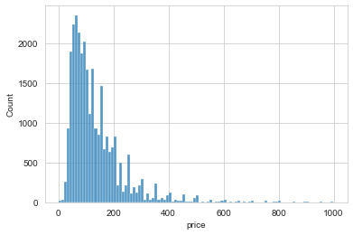
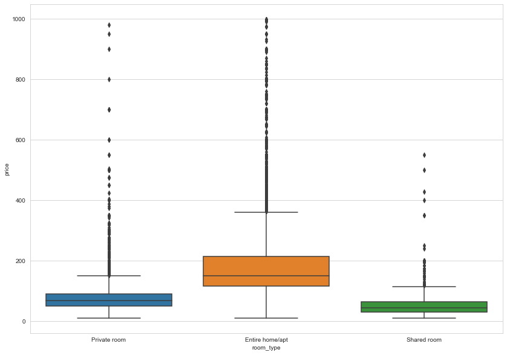
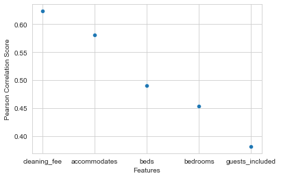

### How to find a well worth airbnb room in New York?

Boyuan Cui (bc594)/Sicheng Zhao (sz629)

### Problem Statement

In New York City, there are hundreds of hotels to choose from, and as of September 2021, over 36,000 Airbnb rentals—both rooms to rent in occupied homes or entire apartments or townhouses. Like New York City itself, its hotels and Airbnb rentals are diverse, unique, and come with a sliding scale of price points from 1000 a night to under 100.

However, currently there is no convenient way for a new Airbnb host to predict the price of his or her listing. New hosts must often rely on the price of neighbouring listings when deciding on the price of their own listing. A system that may tell people which feature of an Airbnb room is important and how much does each type of room worth is in great demand.

### Dataset and Work flow

To reach this goal, we deside to build a prediction model based on the New York [listing dataset](https://www.kaggle.com/c/airbnblala/data?select=analysisData.csv) and [calendar dataset](http://data.insideairbnb.com/united-states/ny/new-york-city/2021-09-01/data/calendar.csv.gz). 

The listing data contains 29142 rows and 96 features, including number of people accommodated, bedrooms, beds, review scores, host response rate and so on.

The calendar data contains 13469123 rows and 7 feature, including listing_id, data, available, price, adjusted_price, minimum_nights, maximum_nights.

The project involved the following steps:

- **Exploratory Data Analysis**: Explore the various features, their distributions using Histograms and Box-plots
- **Pre-processing and Data Cleaning**: Normalisation, filling missing values, encoding categorical values
- **Feature Selection**: Study the correlation with response variable (Listing Price) and determine which features are most useful in predicting the price.
- **Model Fitting and Selection**: Training different models, tuning hyper-parameters and studying Model performance using Learning Curve. Possible models may include : *KNN*,  *Linear Regression, Decision Tree Regression, and Random Forest Regression*
- **Conclusion**: Based on the model we have trained and give out a plan on how to choose Airbnb room in right price range.

### Initial Exploration and Feature Selection

For out inital dataset, we make some pre-processing and do a basic exporatoty of our two datasets. 

Since our goal is to predict the price, and the price colums from the listing dataset is stored in string type, so we first change the string into float type and we draw a heatmap based on price, longitude and latitude

Then we plot the price distribution to get a overall view.

We find that the most number of prices are in the range of 0~400. 

 After that we do some cleaning of the listing data. We remove all columns with more than 50% missing values. It will be difficult to impute these values since most of the attribute values will be guessed. Next, for the attributes with more than 20% missing values, we will impute them individually. These are `Host Response Rate`, `Host Response Time`,  `access`,  `neighborhood_overview`, `host_about`, `space`, `transit`, `interaction`, `house_rules`, `host_response_rate` and`neighbourhood `. We drop the text feature and fill other missing numerical values with mean value and the are 75 features left. 

The pre-processing operations involved are listed in the following table.

| Name            | Feature Type | Operation                                               |
| --------------- | ------------ | ------------------------------------------------------- |
| Imputer         | Numerical    | Replace NULL values with Median                         |
| Standard Scaler | Numerical    | Standardise input data to have 0 mean and unit variance |
| Ordinal Encoder | Categorical  | Encode discrete values into integers                    |

The most obvious feature that is related closely to `price` is location and we use feature `zipcode` to represent the location so we convert it into one hot code for further analysis. In addtion, the `room type` is another import feature when considered the price. So we draw a box plot to show the relation between three types of rooms.

Besides the `zipcode`, we do the pearson correlation with price and other numerical feature, we figure out that the top five numerical correlation features are `cleaning_fee`, `accommodates`, `beds`, `bedrooms`, `guests_included`

Also, to prepare the future predicion, we splite our dataset into the following portion.

| Data       | Purpose                       | Split Ratio | Number of Samples |
| ---------- | ----------------------------- | ----------- | ----------------- |
| Training   | To fit Model                  | 0.8         | 23,313            |
| Validation | To tune hyperparameters       | 0.1         | 2914              |
| Test       | To evaluate model performance | 0.1         | 2914              |

### Plan for Future Work

We plan to continue put some time on exploring and selecting crucial features, also some features such as location needs to be further modified in order to apply to our model. In addtion, consider that time period may also have a strong influence on the price fluctuation, we plan to take steps to explore the calendar dataset and try to combine the time information with the price to see how they may related to each other.

After finishing dealing with the raw data, we decide to apply several models to our dataset and test the performance. 

Since this is a Regression task (predicting the price of listing), various evaluation metrics such as *Variance Explained Score*, *Mean Absolute Error*, *R2-score*, *RMSE (Root Mean Squared Error)* can be used. In this project, *RMSE* and *R2_score* are used to evaluate and compare different Machine Learning Models.

- The RMSE tells us how well a regression model can predict the value of the response variable in absolute terms while R2 tells us how well a model can predict the value of the response variable in percentage terms.

Before trying various Machine Learning Models, it is important to set baseline performances based on simple heuristics or simple models. So we will first run a baseline model *K-Nearest Neighbours Regression* to see how it performs on our data set. After that, we will apply *Linear Regression*, *Decision Tree Regression*, and *Random Forest Regression* to compare their performances.

